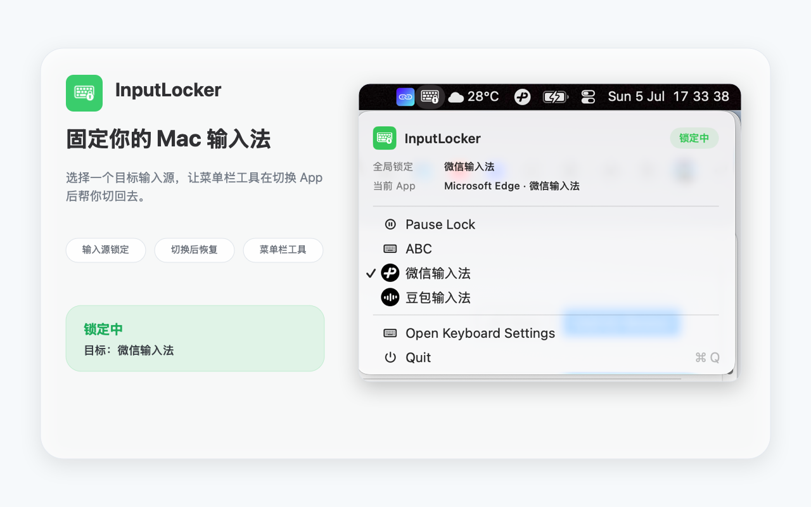

# InputLocker

[English](README.md) | 简体中文

InputLocker 是一个轻量的 macOS 菜单栏工具，用来把键盘输入法锁定在你选择的目标输入法上。

它使用 macOS Text Input Source Services，不使用私有 API。这个锁定是实用型的，不是系统级强制锁：当 macOS 或某个 App 切换输入法后，InputLocker 会把输入法切回目标值。



## 功能

- 在菜单栏里选择目标键盘输入法。
- 不退出 App 即可暂停或重新开启锁定。
- 在紧凑的菜单面板里查看目标输入法、当前 App 和当前输入法。
- 在 App 切换后重新应用目标输入法，并通过轻量定时检查兜底。
- 可直接打开 macOS 键盘设置。
- 界面已本地化：英文、简体中文、繁体中文、日文、韩文。

## 系统要求

- macOS 13 或更高版本。
- 从源码构建时需要 Xcode Command Line Tools。

## 从源码运行

```sh
swift run InputLocker
```

## 构建 App Bundle

```sh
chmod +x Scripts/build-app.sh
Scripts/build-app.sh
open .build/InputLocker.app
```

SwiftPM 构建脚本会生成 `.build/InputLocker.app`，并把资源复制进 App bundle。

## Xcode 与 TestFlight

仓库内也包含可归档的 macOS Xcode 项目：

```sh
xcodebuild -project InputLocker.xcodeproj -scheme InputLocker -destination 'platform=macOS' test
```

如需准备 App Store Connect 或 TestFlight 构建，复制示例环境文件并填入本机真实凭据：

```sh
cp .agents/skills/apple-tf-upload/.env.example .tf-upload.env
.agents/skills/apple-tf-upload/scripts/upload.sh --dry-run
```

不要提交 `.tf-upload.env`；它已经被刻意加入忽略规则。

## 测试

```sh
swift test
```

## 说明

部分安全输入框或系统拥有的文本区域仍可能覆盖第三方输入法。InputLocker 不会绕过 macOS 的安全规则。

## 更新日志

见 [CHANGELOG.zh-CN.md](CHANGELOG.zh-CN.md)。
